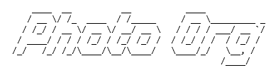

A tool to help manage backups of a media file collection to removable disks.

photoorg.py creates and stores an index of a folder tree of images and other media.
It can compare indexes and highlight differences and generate sync scripts, and a few other things.

## Usage

### Index a folder of media.
Indexes are stored as a single file (photoorg.json) in the root directory of the tree. No other files are added in the tree.

`photoorg.py index f:\backup\photos`

### Index a folder a bit quicker
Does not extract EXIF data.

`photoorg.py index f:\backup\photos -quick`

### Update an existing index with changes on disk

`photoorg.py index f:\backup\photos -update`

### Compare two indices

`photoorg.py diff f:\backup\photos g:\backup\photos`

### Generate commands to sync from one index to another
Prints commands to stdout, no files are altered. Windows only for now, sorry.

`photoorg.py sync f:\backup\photos g:\backup\photos`

### Search an index for duplicate images
Detects duplicate hashes

`photoorg.py dedupe f:\backup\photos`

### Search one index for the images in another index

`photoorg.py find h:\weird_random_photos f:\backup\photos`

### Detailed compare of two images
Does not need an index.

`photoorg.py diff-images f:\backup\photos\x\y\z.jpg g:\backup\photos\x\y\z.jpg`
